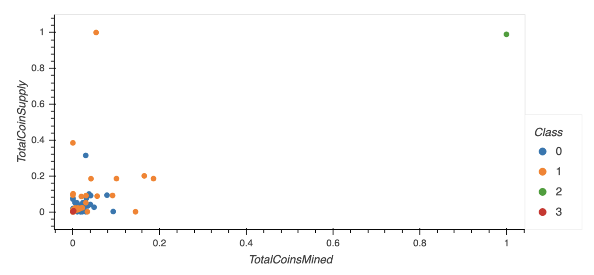

# Cryptocurrencies

- Use unsupervised machine learning to determine patterns in cryptocurrencies.

- A 3D scatter plot was created using the Plotly Express scatter_3d() function to plot the three clusters.

- A scatter plot was made to show the connection between Total Coin Supply and Total Coins Mined

